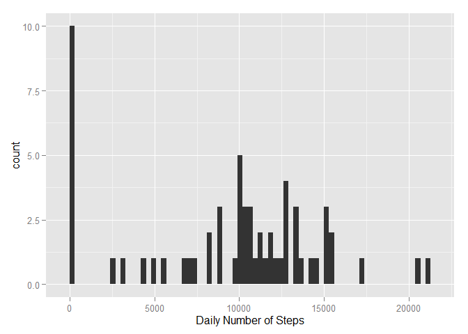
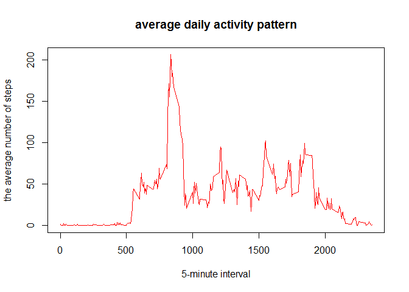
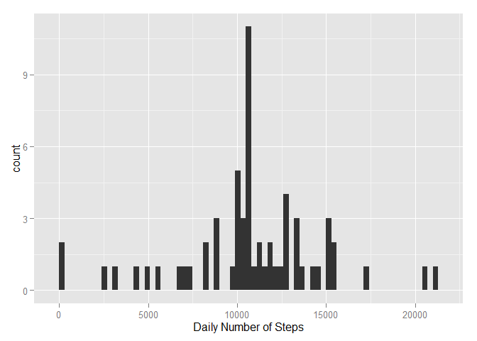

# Reproducible Research: Peer Assessment 1


## Loading and preprocessing the data

```r
activity<-read.csv("activity.csv")
activity$date<-as.Date(activity$date)
str(activity)
```

```
## 'data.frame':	17568 obs. of  3 variables:
##  $ steps   : int  NA NA NA NA NA NA NA NA NA NA ...
##  $ date    : Date, format: "2012-10-01" "2012-10-01" ...
##  $ interval: int  0 5 10 15 20 25 30 35 40 45 ...
```

## What is mean total number of steps taken per day?

```r
step_day<-group_by(activity, date)
sum_step_day<-summarize(step_day, total_steps=sum(steps,na.rm = T))
qplot(total_steps, data = sum_step_day, geom="histogram", colors="red", xlab = "Daily Number of Steps", binwidth = 300)
```

 


```r
means<-mean(sum_step_day$total_steps,na.rm = T)
medians<-median(sum_step_day$total_steps, na.rm=T)
```
The  **mean**  total number of steps taken per day is **9354**

The  **median**  total number of steps taken per day is **10395**


## What is the average daily activity pattern?

```r
step_interval<-group_by(activity, interval)
mean_step_interval<-summarize(step_interval, means=mean(steps,na.rm = TRUE))
with(mean_step_interval, plot(interval,means, type="l", col="red",xlab="5-minute interval", ylab="the average number of steps", main="average daily activity pattern"))
```

 


```r
max_interval<-mean_step_interval[which.max(mean_step_interval$means),]
```
**835** 5-minute interval, on average across all the days in the dataset, contains the maximum number of steps


## Imputing missing values

```r
isNa<-!complete.cases(activity)
missing_number<-sum(isNa)
```
The total number of missing values in the dataset is **2304**


```r
activity<-merge(activity, mean_step_interval,by="interval", all.x = T)
activity[is.na(activity$steps),]$steps<-activity[is.na(activity$steps),]$means
step_day<-group_by(activity, date)
sum_step_day<-summarize(step_day, total_steps=sum(steps,na.rm = T))
qplot(total_steps, data = sum_step_day, geom="histogram", colors="red", xlab = "Daily Number of Steps", binwidth = 300)
```

 


```r
means<-mean(sum_step_day$total_steps,na.rm = T)
medians<-median(sum_step_day$total_steps, na.rm=T)
```
The  **mean**  total number of steps taken per day is **10766.2**

The  **median**  total number of steps taken per day is **10766.2**

###Answer the Question:
The mean and median with two different methods of data cleaning are closing very much. On the second way, because the mean is used to replace 'NA', so mean and median are moving closer.

## Are there differences in activity patterns between weekdays and weekends?

```r
activity<-cbind(activity, weekdays=weekdays(activity$date))
activity$weekdays<-as.character(activity$weekdays)
weekend<-c("Sunday", "Saturday")
activity[activity$weekdays %in% weekend,5]<-"weekend"
activity[activity$weekdays!="weekend",5]<-"weekday"
activity[,5]<-as.factor(activity[,5])
step_weekdays<-group_by(activity, weekdays, interval)
step_mean_weekdays<-summarize(step_weekdays, average=mean(steps))
xyplot(average~interval | weekdays, data = step_mean_weekdays,
      type = 'l',
      xlab = 'Interval',
      ylab = 'Number of Steps',
      layout = c(1,2))
```

 


